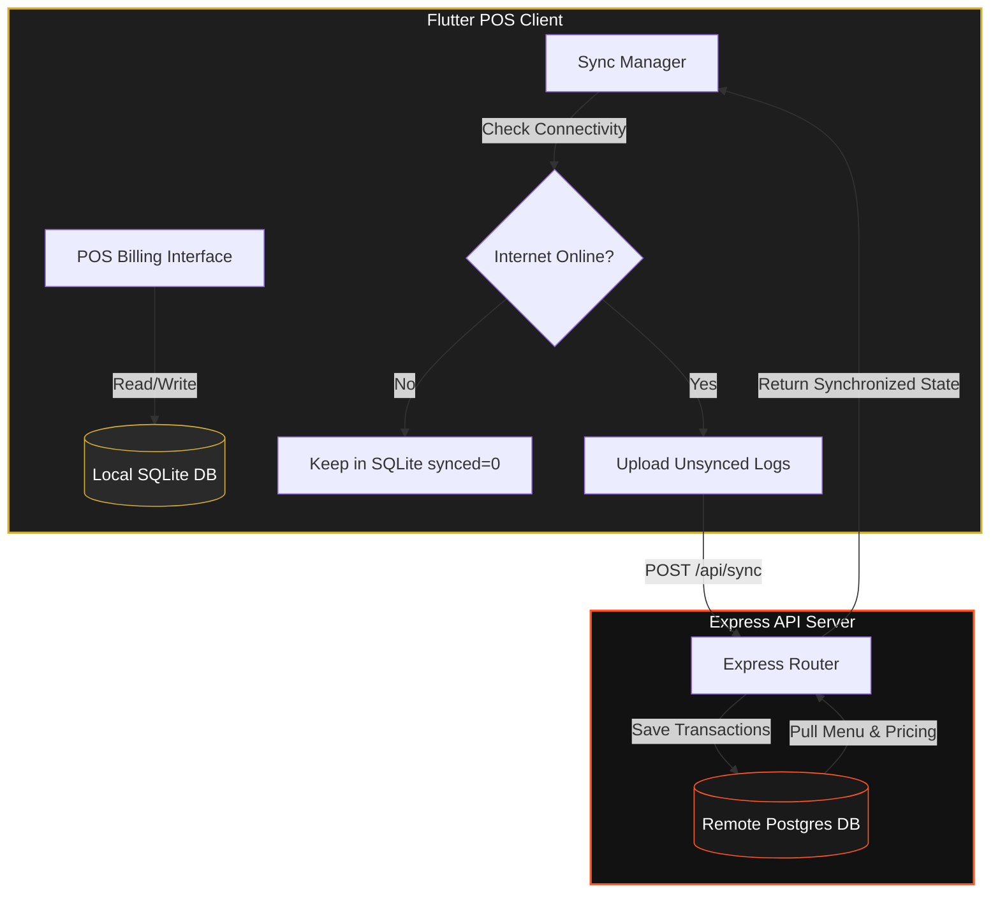

# BOOTO SHAWARMA POS & Order Management App

A production-ready, mobile-first Android POS and Order Management application designed for **BOOTO SHAWARMA**. Featuring a high-fidelity **Black, Gold, and Orange** themed interface, the project is structured with a Node.js + Express backend service connected to PostgreSQL, and a Flutter mobile client app configured with local SQLite database storage and offline synchronization.

---

## 🛠️ Technology Stack

* **Frontend Client:** Flutter (Android POS Target)
* **Backend REST API:** Node.js + Express
* **Production Database:** PostgreSQL
* **Local Offline Storage:** SQLite
* **Offline Sync Strategy:** Background/Foreground HTTP Synchronization
* **Security & Auth:** JWT Sessions + Admin PIN Login (`1234`)

---

## 📐 System Architecture

The POS app acts as the point of sale. Even when the internet is unavailable, orders are checked out locally in SQLite. When online connectivity is restored, the synchronization engine syncs local sales to PostgreSQL and pulls down the latest menu prices.



---

## 📦 Database Tables Schema

* **`users`**: Manages admin and staff credentials, storing hashed PIN values (`1234` by default).
* **`categories`**: Menu categories: Shawarma, Lays Shawarma, Plate Shawarma, Mug Shawarma, and Special Shawarma.
* **`menu_items`**: Complete list of Shawarma variants and prices (e.g. Lays Classic for ₹130, Mug Spicy for ₹160).
* **`customers`**: Profiles compiled automatically during checkouts (name, mobile, purchase logs).
* **`orders`**: POS order tickets including subtotal, discounts, total amount, order type, and state flags.
* **`order_items`**: Line details for variants, chosen extras (Extra Cheese +₹20, Extra Mayo +₹10, Extra Peri Peri +₹10), and special instructions.
* **`sales_reports`**: Materialized sales history entries for reporting ranges.

---

## 🚀 Installation & Local Setup

### 1. Database Setup (PostgreSQL)

You can run PostgreSQL locally or start it using Docker:

#### Run via Docker
```bash
docker run --name booto-postgres -e POSTGRES_USER=postgres -e POSTGRES_PASSWORD=postgres -e POSTGRES_DB=booto_shawarma -p 5432:5432 -d postgres:latest
```

#### Seed Schemas
Once PostgreSQL is running, connect to it and execute the SQL initialization file:
```bash
# Connect and apply database tables, indexes, and menu seeds
psql -h localhost -U postgres -d booto_shawarma -f backend/schema.sql
```

---

### 2. Backend Setup (Node.js)

1. Navigate to the backend directory:
   ```bash
   cd backend
   ```
2. Verify dependencies are installed:
   ```bash
   npm install
   ```
3. Configure the environment variables in `backend/.env`. (Configure port, database credentials, and secrets).
4. Spin up the server:
   ```bash
   # Run in production mode
   npm start
   
   # Run in developer nodemon mode
   npm run dev
   ```
5. Confirm server health by accessing: `http://localhost:5001/health`

---

### 3. Frontend Setup (Flutter)

1. Open the project inside an editor or navigate to the directory:
   ```bash
   cd frontend
   ```
2. Fetch dependencies:
   ```bash
   flutter pub get
   ```
3. Boot the application on your target Android Emulator or Device:
   ```bash
   flutter run
   ```

---

## 📲 APK Build Instructions (Android Release)

To compile a production-ready release APK for deployment on physical POS Android machines:

1. Configure the server IP endpoint within the application:
   * Launch the app.
   * On the **Login Screen**, input PIN `1234` to login.
   * Access the **Settings Screen** (Gear Icon in top right).
   * Update **Server API Endpoint URL** to your server's public IP address (e.g. `http://192.168.1.15:5001/api`) and click **SAVE**.
2. Run the compiler in the `frontend` folder:
   ```bash
   flutter build apk --release
   ```
3. Retrieve the generated package at:
   `frontend/build/app/outputs/flutter-apk/app-release.apk`
4. Install this file on your POS tablets or Android devices.

---

## 🍽️ POS User Guide

* **PIN Authentication:** Access the system with PIN `1234` (stored hashed). If offline, session verification falls back securely to local storage.
* **Creating Orders:** Tap **NEW ORDER** in the dashboard. Choose a Category -> Variant -> Quantities -> Add-ons (e.g. Extra Cheese) -> input instructions. Click **ADD TO ORDER**. Input billing type (Dine In/Take Away) and check out.
* **Order Statuses:** Go to **Orders** tab. You will see columns for **PENDING** and **READY** orders. Click a ticket to view invoice receipts and trigger updates (MARK READY -> MARK COMPLETED -> CANCEL).
* **Syncing Details:** The app will automatically sync in the background when network connectivity becomes active. You can also trigger manual synchronization from the **Settings Screen**.
* **Exports & Backups:** Use the Settings panel to download PDF/Excel invoices logs, trigger server-side JSON database backups, or wipe daily POS counters.
